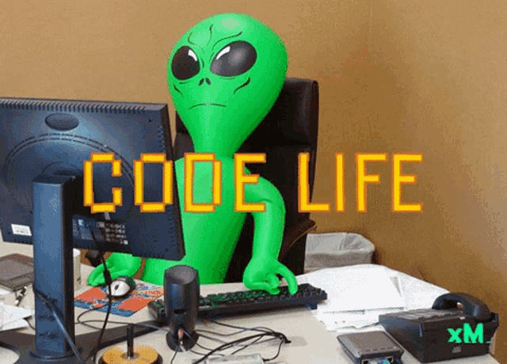
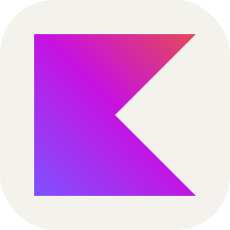
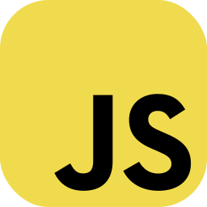
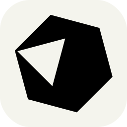
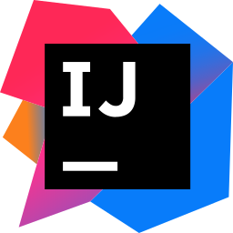
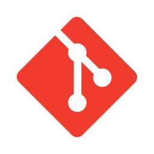
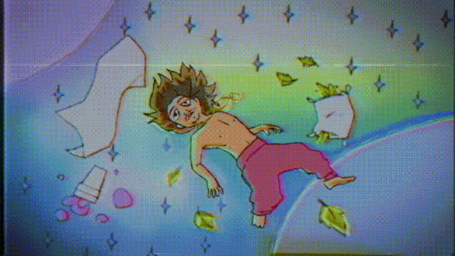

# 🍬 Hello, I'm Balah, a little programming student.

Hello! Pleasure to meet you. Allow me to introduce myself briefly.
  <ul>
    <li>💻 I want to be a <b>Software Engineer</b>;</li>
    <li>📍 I am from <b>Brazil 🇧🇷</b>;</li>
    <li>🏢 I am currently studying to get my <b>First Job</b>;</li>
    <li>🌱 I'm currently learning <b>Android Development</b> with <b>Kotlin</b> and <b>English</b>;</li>
    <li>💬 You can ask me about <b>Kotlin, Android, Mobile, Discord so on</b>;</li>
    <li>🩸 Living with <b>type 1 Diabetes</b>;</li>
    <li>☕ I do not like <b>Coffee</b>;</li>
    <li>🎛️ I'm unmatched when it comes to <b>Matuê</b>.</li>
  </ul>

Hello! I’m Kayo César, born in 2008, and passionate about <b>Android development</b>. I’m currently studying <b>Kotlin</b> to start exploring the Android world and create useful and practical apps for everyday life. Although I have Type 1 diabetes, I lead a normal life with proper care. Alongside coding, I’m also diving into <b>English</b> studies, currently at a beginner level. My favorite programming language is <b>Crystal</b>, and I plan to specialize in backend development with it in the future. I also dabble in Node.js with <b>JavaScript</b> since it was my first programming language. Additionally, I create content on <b>YouTube</b> to share experiences, stories, and some programming tips. Feel free to reach out to me through my social media. Cheers! 🚀 <3

## 🌐 Find more about me at :

  
  
   
   

## 🖥️ My tech stacks :

  <h3><i>Languages :</i></h3>
  <table>
  <tr border: none;>
    <td align="center" width="110">
      
       KOTLIN
    </td>	
    <td align="center" width="110">
      
       JAVASCRIPT
    </td>  
    <td align="center" width="110">
      
       CRYSTAL
    </td>
  </tr>
</table>

  <h3><i>IDEs :</i></h3>
  <table>
  <tr border: none;>
<!--     <td align="center" width="110">
      
       ANDROID STUDIO
    </td>	   -->
    <td align="center" width="110">
      
       INTELLIJ IDEA
    </td>
    <td align="center" width="110">
      
       VS CODE
  </tr>
</table>

  <h3><i>Other tools :</i></h3>
  <table>
  <tr border: none;>
    <td align="center" width="110">
      
       LINUX
    </td>	  
    <td align="center" width="110">
      
       GIT
    </td>
    <td align="center" width="110">
      
       NODE JS
    </td>
  </tr>
</table>

# 📊 Statistics :

	
  
<b>⚡ Github Stats</b>

  
   
        
        

	
  
<b>☄️ Github Streaks</b>

   

  

	
  
<b>⏰ Last Year Coding Time</b>

   

	
  
<b>💬 Discord Profile</b>

   
  

<!--

  
<b>🧑‍🚀 Open Source Projects</b>

   
  <table>
    <thead align="center">
      <tr>
        <th><b>💻 Projects</b></th>
        <th><b>🌟 Stars</b></th>
        <th><b>🍴 Forks</b></th>
        <th><b>🐛 Issues</b></th>
        <th><b>🔔 Pull Requests</b></th>
        <th><b>👨‍💻 Language</b></th>
      </tr>
    </thead>
    <tbody>
      <tr>
        <td><a href="."><b>📦 null</b></a></td>
        <td></td>
        <td></td>
        <td></td>
        <td></td>
        <td></td>
  <!--
  Stars: https://img.shields.io/github/stars/linitio/linitio?style=flat-square&labelColor=343b41
  Forks: https://img.shields.io/github/forks/linitio/openstack-alpine-image?style=flat-square&labelColor=343b41
  Issues: https://img.shields.io/github/issues/linitio/openstack-alpine-image?style=flat-square
  PR: https://img.shields.io/github/issues-pr/linitio/openstack-alpine-image?style=flat-square
  Lang: https://img.shields.io/github/languages/top/linitio/openstack-alpine-image?style=flat-square
  ----------------------------------------------------------------
      </tr>
    </tbody>
  </table>
   

-->

	
   
  
<b>⚙️ Hardware</b>

  	<ul>
  	  <li><b>OS:</b> Arch Linux (GNOME 47)</li>
	    <li><b>Laptop: </b> Lenovo IdeaPad 3i</li>
  	  <li><b>Browser: </b> Firefox</li>
      <li><b>Cpu:</b> AMD Ryzen™ 5 5500U with Radeon™ Graphics × 12</li>
	    <li><b>Terminal: </b> ZSH: Oh My Zsh (Gnome Terminal)</li>
	</ul>	

#

### Thank you for getting here! ❤️🍬

---

    

        
 Matuê - Anos Luz

        
    

    

        
 Matuê - Vem Chapar

        
    

